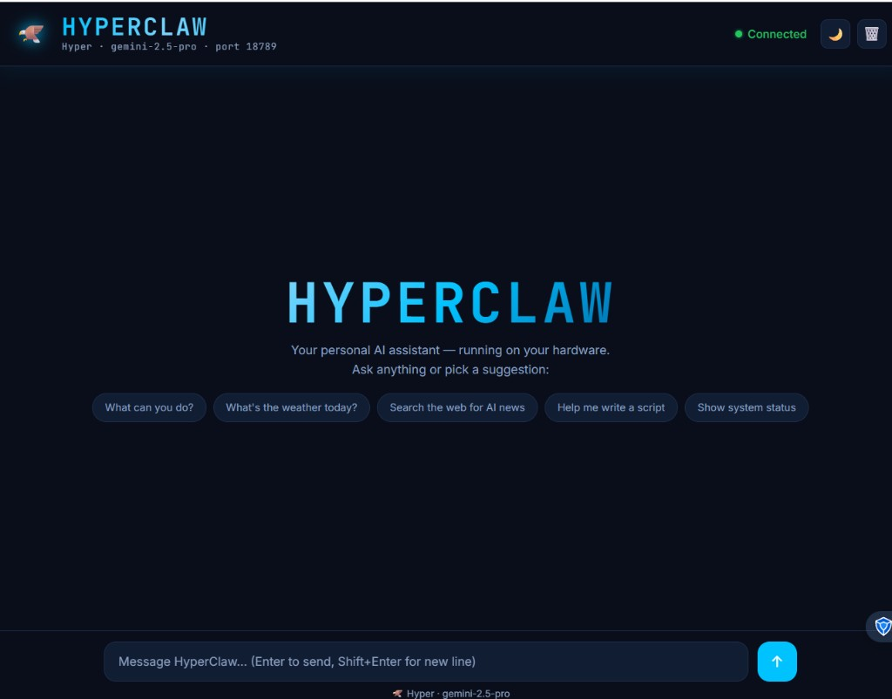
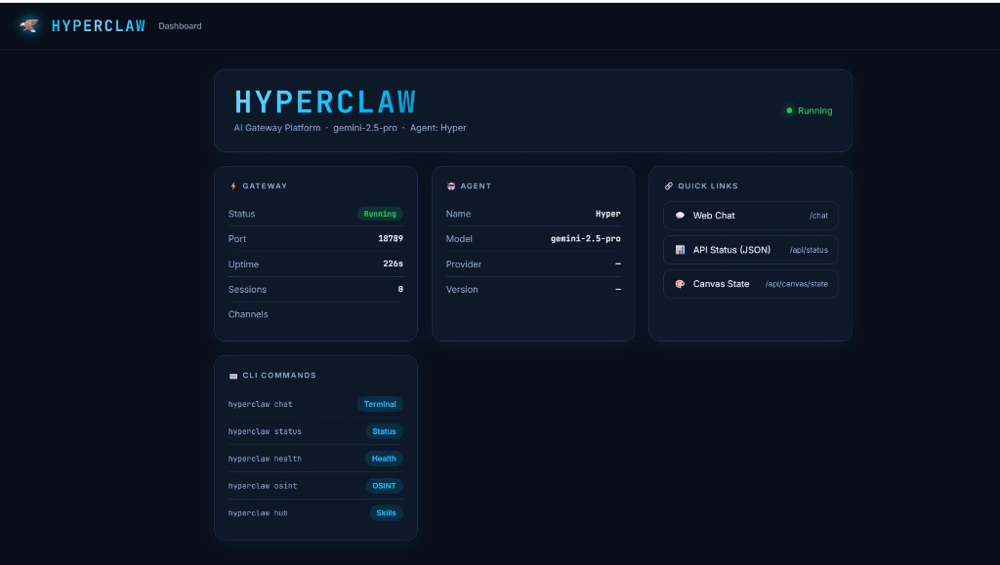

<a name="top"></a>

# 📸 HyperClaw — Screenshots

<div align="center">

[🏠 Main README](README.md) &nbsp;•&nbsp; [📚 Docs](docs/README.md)

</div>

---

> Run `hyperclaw daemon start` then open `http://127.0.0.1:18789/chat` to see the web UI.

---

## CLI — Terminal Interface

### Main banner
```bash
hyperclaw
```
<div align="center">
  
</div>

---

### Daemon mode
```bash
hyperclaw daemon start
```
<div align="center">
  
</div>

> 🩸 Red banner = full PC access mode. After start, open `http://127.0.0.1:18789/chat`

---

### Setup wizard
```bash
hyperclaw onboard
```
<div align="center">
  
</div>

---

### Setup wizard — AI providers
```bash
hyperclaw onboard   # Step 2 / 9
```
<div align="center">
  
</div>

---

### Setup wizard — API key entry
```bash
hyperclaw onboard   # Step 2 / 9 → select provider → enter key
```
<div align="center">
  
</div>

---

### Daemon install mode
```bash
hyperclaw onboard --install-daemon
```
<div align="center">
  
</div>

> Grants full PC access. Runs as system service on every boot.

---

### Security notice
```bash
hyperclaw onboard --install-daemon   # shows before granting access
```
<div align="center">
  
</div>

---

### Theme selection
```bash
hyperclaw theme
# or during onboard wizard
```
<div align="center">
  
</div>

---

### TUI Dashboard
```bash
hyperclaw dashboard
```
<div align="center">
  
</div>

> Press `[d]` daemon · `[h]` hub · `[g]` gateway · `[m]` memory · `[q]` quit

---

### Terminal chat
```bash
hyperclaw chat
```
<div align="center">
  
</div>

> Commands inside chat: `/model` · `/skills` · `/clear` · `/exit`

---

### All commands
```bash
hyperclaw --help
```
<div align="center">
  
</div>

---

### System status
```bash
hyperclaw status
```
<div align="center">
  
</div>

---

### Health check
```bash
hyperclaw health
```
<div align="center">
  
</div>

---

### Security tools
```bash
hyperclaw security
hyperclaw security audit
```
<div align="center">
  
</div>

---

### 🕵️ OSINT / Ethical Hacking mode
```bash
hyperclaw osint
hyperclaw osint setup    # interactive session setup
hyperclaw osint --show   # show current profile
```
<div align="center">
  
</div>

> Available workflows: `recon` · `bugbounty` · `pentest` · `footprint` · `custom`  
> For authorized security research only. Always have explicit written permission.

---

## Web UI — Browser Interface

> **Requires gateway running:** `hyperclaw daemon start`  
> Then open in browser: `http://127.0.0.1:18789`

### Web Chat
```
http://127.0.0.1:18789/chat
```
<div align="center">
  
</div>

> Real-time WebSocket chat · Streaming responses · Dark/Light theme · Markdown rendering

---

### Web Dashboard
```
http://127.0.0.1:18789/dashboard
```
<div align="center">
  
</div>

> Live gateway status · Model info · Sessions · Quick links

---

<div align="center">

[🏠 Main README](README.md) &nbsp;•&nbsp; [📚 Docs](docs/README.md)

</div>
<div align="right"><a href="#top">▲ Back to top</a></div>
